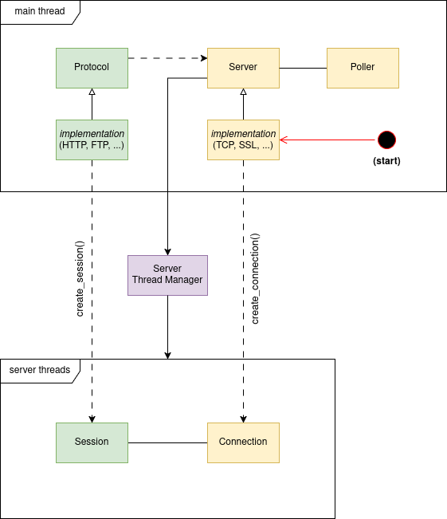

# neblina2

**This is work in progress**

**Neblina** is an extensible internet server that works with multiple protocols. Examples of protocols (eventually)
supported are HTTP, HTTPS, FTP, SFTP, XMMP, NNTP, etc. 

*Neblina* consists of single executable file that contains everything - new protocols and applications can be extended
by providing a `.dll` or `.so` file. For web applications, a few functionalities are also embedded, such as database
(via SQLite), CORS and Oauth2 support.

The application is tested and runs on Windows, Linux, Mac and FreeBSD.

## Current state

Currently, only the base server is implemented (support for TCP and SSL).

The diagram below shows how the application is organized. The main abstract classes are **Server** and **Protocol**.
**Server** provides the connectivity (ex. TCP, SSL, etc), and **Protocol** provides the communication protocol (HTTP,
FTP, etc). For example: TCP with HTTP is HTTP, while SSL with HTTP is HTTPS.

When a new connection is open by a client, the Server will provide a **Connection**, and the Protocol will provide
a **Session**. The **Connection** will handle communication with the client, and the **Session** will translate the
communcation into the protocol, and handle session-specific information.

The server keeps a thread pool, with multiple connections per threads. This allows the server to handle a very large
number of clients.

The main application is still not implemented, only tests. The following targets are available:

* **neblina-tests** - run the unit tests
* **neblina-leaks** - run the unit tests and check for leaks (valgrind)
* **neblina-helgrind** - run the unit tests and check for thread errors (valgrind - helgrind)
* **neblina-drd** - run the unit tests and check for thread errors (valgrind - drd)
* **neblina-load-test** - run a load test on the server

When a PR is created on github, a Github Actions pipeline will fire the execution of multiple tests in all supported
operating systems. When a tag is created, a pipeline will create a Windows downloadable executable, and place it on the
"Release" section of the Github page.

(Load tests are currently failing on Windows - suggestion, try using libevent)

## Future state

See [TODO](TODO.md).
